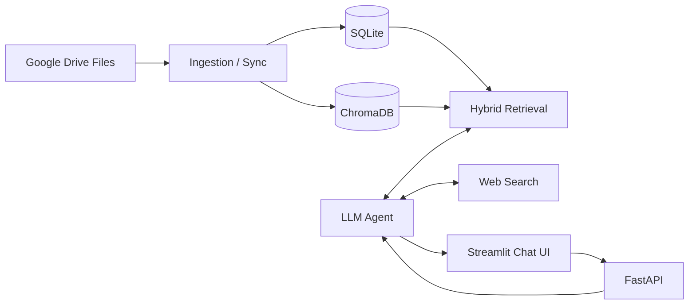
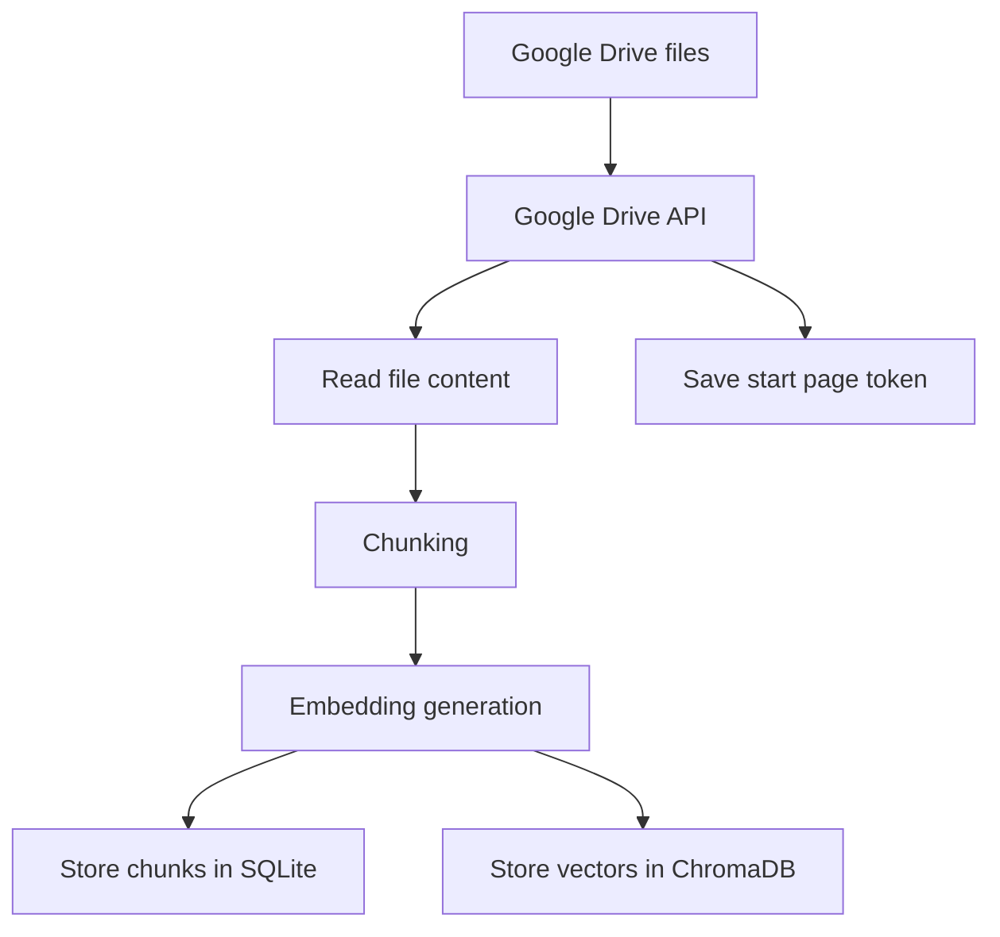
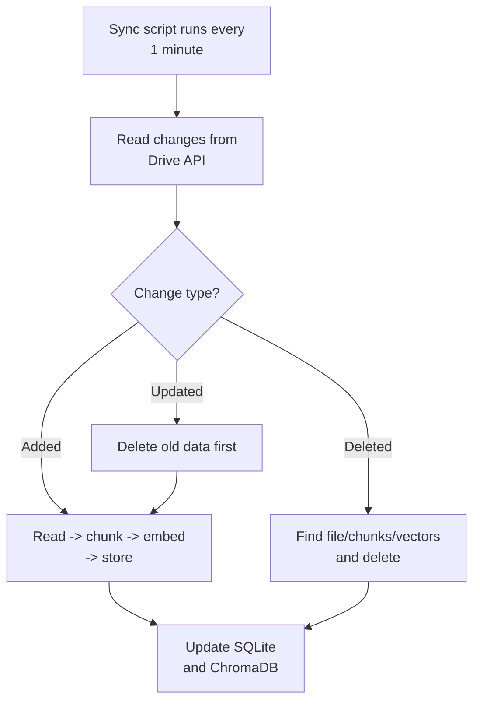
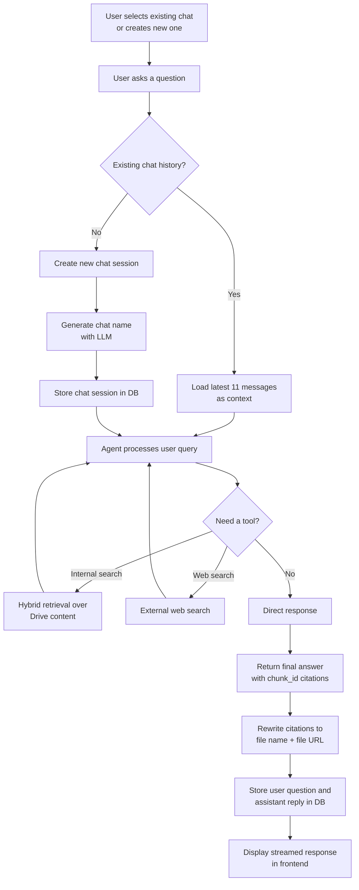
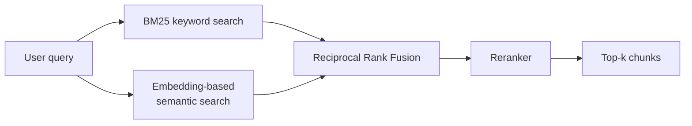

# Google Drive RAG Architecture

This page shows the end-to-end process of the app in three parts:
1. Data ingestion and sync
2. Chat and answer generation
3. Hybrid RAG retrieval

## 1. System Overview

## 2. Data Flow

### A. Source and ingestion

The data source is Google Drive files.

### B. Initial indexing process

1. The app reads files from Google Drive through the Google Drive API.
2. Supported file types are exported or downloaded.
3. Content is split into chunks.
4. Each chunk is embedded.
5. Chunk text and metadata are stored in SQLite.
6. Embeddings are stored in ChromaDB.
7. After indexing, the latest start page token is saved for later sync.

### C. Ongoing sync process

The sync script runs every minute and checks Google Drive changes through the Google Drive API.

### D. What happens for each change

- Added file:
  - Read file from Drive
  - Chunk content
  - Generate embeddings
  - Store into SQLite and ChromaDB
- Deleted file:
  - Find related file rows, chunk rows, and vector rows
  - Delete them from SQLite and ChromaDB
- Updated file:
  - Delete the old file/chunk/vector records
  - Reprocess the file from the beginning

### E. Important implementation detail

The app also avoids re-indexing duplicate chunk content by hashing chunk text before insert.

## 3. Chat Flow

### A. Frontend behavior

1. The user selects an existing chat session or creates a new one.
2. The user types a question in the Streamlit chat UI.
3. The UI calls the FastAPI backend and streams the assistant response.

### B. Context handling

If the chat session already exists, the backend loads the latest 11 conversation messages as context.

### C. New chat naming

If this is a new chat session, the app uses the LLM to generate a conversation name and stores the chat session in SQLite.

### D. Tool-using agent

The agent decides whether it needs to call a tool.

Available tools in the project:
- Internal search over Drive content
- Web search

### E. Citations and storage

1. The agent produces a final answer with chunk_id citations in the original response.
2. The response is rewritten so chunk_id citations become readable file-name links with URLs.
3. Both the user question and assistant response are stored in the conversation history table.
4. The frontend displays the streamed final answer.

## 4. Hybrid RAG

### Retrieval steps

1. BM25 retrieves chunks by keyword overlap.
2. The embedding model retrieves chunks by semantic similarity.
3. The results are combined using Reciprocal Rank Fusion (RRF).
4. A reranker scores the merged candidates again.
5. The top-k chunks are passed to the agent.

## 5. One-Sentence Summary

Google Drive files are ingested into a local hybrid RAG index, synced incrementally, and exposed through a chat interface that uses retrieval, tools, and citation rewriting to answer questions with source links.
